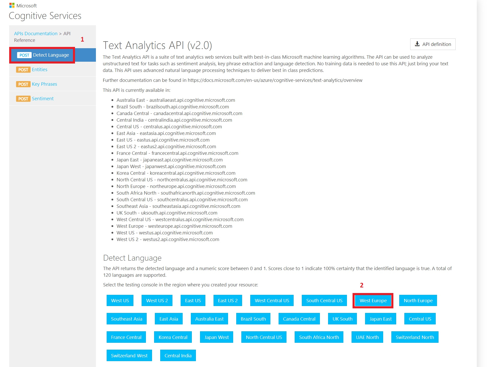

# AI-10X demos
Demos for [AI-10X](https://docs.microsoft.com/en-us/learn/certifications/exams/ai-100) training and certification. It can be used by trainer or by attendees as homework. Goal is to understand how to call and use REST API for Cognite Services.

# Before you start
- Become familiar with [Azure Cloud Shell](https://docs.microsoft.com/en-us/azure/cloud-shell/overview).
- Become familiar with [Az.CognitiveServices](https://docs.microsoft.com/en-us/powershell/module/az.cognitiveservices/?view=azps-5.0.0#cognitive-services) PowerShell module.
- Become familiar with [Environment Variables](https://docs.microsoft.com/en-us/powershell/module/microsoft.powershell.core/about/about_environment_variables?view=powershell-7).
- Become familiar with [Cognitive Services REST API](https://westeurope.dev.cognitive.microsoft.com/docs/services).
- Read comments in code.

## Speech

Demos using speech needs audio files. Some sample audio files are included. Information about [supported audio format](https://docs.microsoft.com/en-us/azure/cognitive-services/speech-service/rest-speech-to-text#audio-formats).

### How to create audio samples

- Record audio sample using Windows 10 Voice Recored. It produces _m4a_ audio file.
- Search for _m4a to wav converter online_.
- Convert _m4a_ to _wav_ file using online tool.
- Rename file to _message-[LANGUAGE_CODE](https://aka.ms/speech/tts-languages).wav_. For example ```message-cs-CZ.wav```.
- Copy audio file to [speech_translator/](speech_translator/) folder.

### Limitation
Python code using microphone and speaker doesn't work in Azure Cloud Shell. You need to run code localy. All Azure Cloud Shell unsoported demos are in [speech_translator/local_pc_folder](speech_translator/local_pc_only/) folder. 


# How to use

- Login to [Azure Cloud Shell](https://shell.azure.com).
- Clone this repository.
  - ```git clone https://github.com/bechynsky/ai100demos.git```
- Install Python libraries.
  - ```pip install azure-cognitiveservices-speech```
- Goto ```ai100demos``` folder.
- Run ```code .``` to open code editor to see code.
- Run [new_cognitiveservices.ps1](new_cognitiveservices.ps1).
  - All information like endpoint and service key is stored in Environment variables. 
  - Check environment variables we create ```printenv | grep CV_``` or ```Get-ChildItem env:* | Where-Object {$_.Name -like 'CV_*'}```.
  - It is not persistent and information is lost after Azure Cloud Shell restarts.
  - Copy output of script for future reference.

# Cognitive Services REST API playground
If you want to chnage calls to REST API you can test it first.

- Open [Api Testing Console](https://westeurope.dev.cognitive.microsoft.com/docs/services)
- Use search on top right to find API.
- Choose API you are looking for.
- Choose nethod you want test on left (1) and then click your region (2).
- Now you can create REST API Call and test it.




# Cleanup
- Run ```cleanup.ps1``` to delete resources in Azure
- Delete ```ai100demos``` folder 